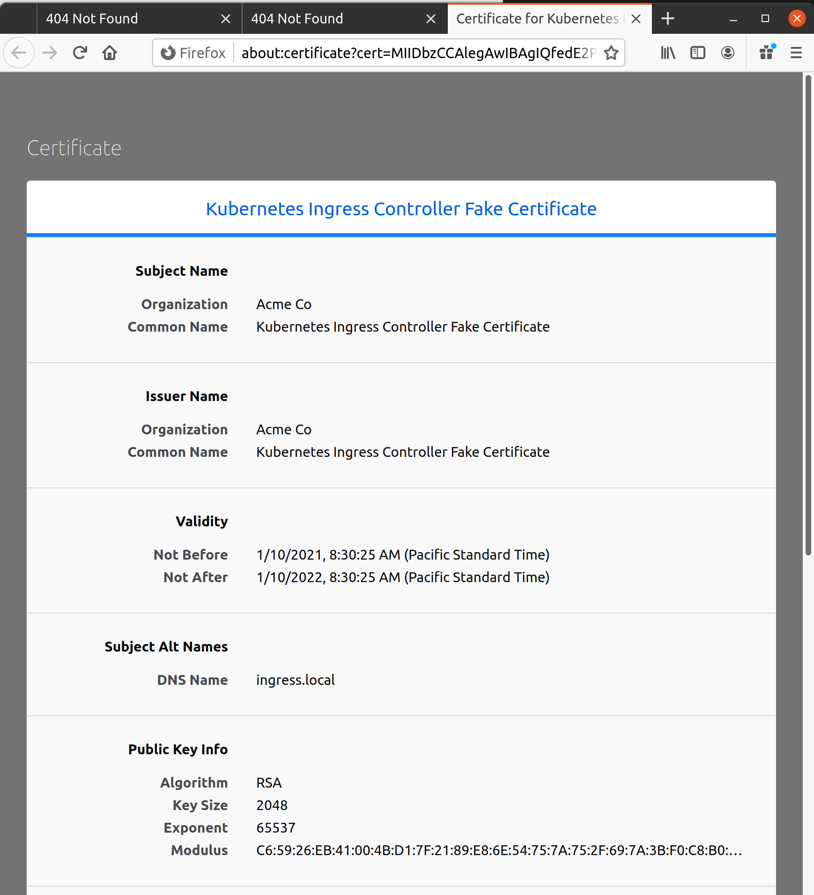
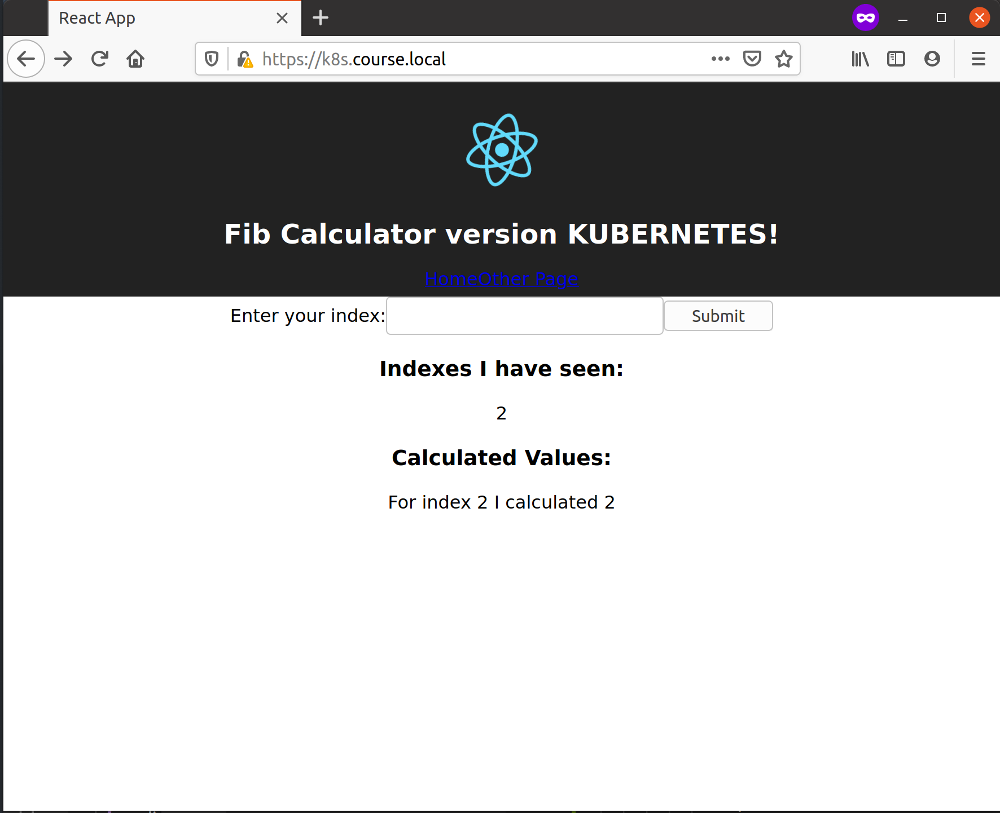
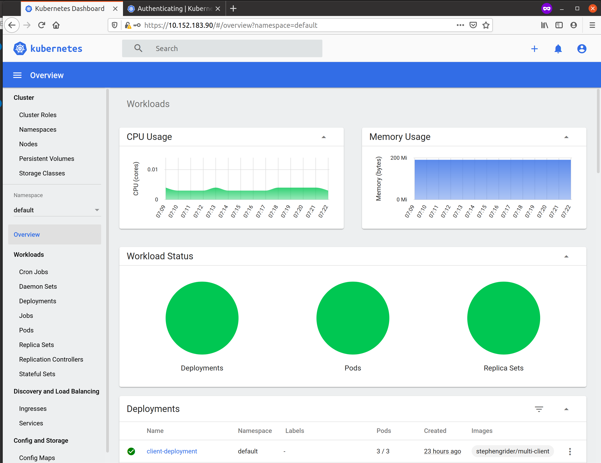

# Docker and Kubernetes Course

https://www.udemy.com/course/docker-and-kubernetes-the-complete-guide/

Good instructor on this course, Stephen Girder, hope to fill in a few gaps on docker and get fully up to speed on kubernetes.

---

## Section 1-3 - basics

Lots of docker info, good diagrams, mostly things I already know. One nice thing to learn is that docker on Mac/Win both use a VM and overlay the docker server on top of that.

`docker build -t aliwatters/redis:latest .` -- tags images that I build, version is technically the "tag" everything else is the project.

Creating images from running containers is via `docker commit -c 'CMD ["redis-server"]' <running-image-id>` -- much better to use Dockerfiles, but interesting.

---

## Section 4 - a simple project

Course project, nodejs web app. All in `simpleweb`.

```
 $ docker build -t aliwatters/simpleweb .
 $ docker run -p 5000:8080 aliwatters/simpleweb
```

Visit: http://localhost:5000/

**Debug**: `docker run -it aliwatters/simpleweb sh`

---

## Section 5 - docker-compose

Server counting app, see `visits` directory. Introduce `docker-compose` -- restarts is something I'd not gone into before.

---

## Section 6 - production grade workflow

Nice, using gitub and feature branches. Changes to the course;

`npx create-react-app frontend` -- rather than install `create-react-app` globally

Yarn is used by default, not npm. Should be able to use interchangebly.

Note; remove `node_modules` before building image. This save 155mb being copied in! (`create-react-app` installs this, only needed in the container which we're setting up for dev)

---

**Lesson 72**:

`docker run -it -p 3000:3000 CONTAINER_ID` -- needs the `-it`

---

**Lesson 75**:

docker volumes, great. `$ docker run -p 3000:3000 -v /app/node_modules -v $PWD:/app bb8db8695daf `

Note: the `-v /app/node_modules` -- doesn't exist in the host, but adds a volume for the image.

---

**Lesson 76**:

`docker-compose` version of the commands above.

---

**Lesson 83**:

On the `docker-compose` test setup. You can still `exec` into the running container and use the ui for react tests. But `docker attach <id>` won't work as explained in the video.

```
$ docker ps
CONTAINER ID        IMAGE                                     COMMAND                  CREATED             STATUS              PORTS                    NAMES
3791196255d8        docker-kubernetes-course-frontend_tests   "docker-entrypoint.s…"   52 seconds ago      Up 51 seconds                                docker-kubernetes-course-frontend_tests_1
fc7561af990d        docker-kubernetes-course-frontend_web     "docker-entrypoint.s…"   53 seconds ago      Up 51 seconds       0.0.0.0:3000->3000/tcp   docker-kubernetes-course-frontend_web_1

$ docker exec -it 3791196255d8 npm run test
 PASS  src/App.test.js
  ✓ renders react link (68 ms)
  ✓ it renders without crashing (14 ms)

Test Suites: 1 passed, 1 total
Tests:       2 passed, 2 total
Snapshots:   0 total
Time:        3.206 s
Ran all test suites.

Watch Usage: Press w to show more.
```

Not perfect either, and as the default is watch mode anyway... not sure if it's that useful.

---

**Lesson 90**: Multi-step builds

Note there is some issues with named builds in AWS right now;

```
updated 10-1-2020

In the next lecture, we will be creating a multi-step build in our production Dockerfile. AWS currently will fail if you attempt to use a named builder as shown.

To remedy this, we should create an unnamed builder like so:

Instead of this:

    FROM node:alpine as builder
    WORKDIR '/app'
    COPY package.json .
    RUN npm install
    COPY . .
    RUN npm run build

    FROM nginx
    COPY --from=builder /app/build /usr/share/nginx/html

Do this:

    FROM node:alpine
    WORKDIR '/app'
    COPY package.json .
    RUN npm install
    COPY . .
    RUN npm run build

    FROM nginx
    COPY --from=0 /app/build /usr/share/nginx/html
```

So -- use the step number and leave out the name.

---

## Section 7 - Deploy to AWS

**Lesson 100+**:
AWS Elastic Beanstalk deployment. Changes in AWS mean;

> When creating our Elastic Beanstalk environment in the next lecture, we need to select **Docker running on 64bit Amazon Linux** instead of _Docker running on 64bit Amazon Linux 2_. This will ensure that our container is built using the Dockerfile and not the compose file.

Note: I also set up a new user, with only permissions on AWS ElasticBeanstalk (for now) for this course.

Created `DockerKubernetesCourseFrontend-env` environment and `docker-kubernetes-course-frontend` application.

Ok ran through all the steps in lessons, and https://github.com/aliwatters/docker-kubernetes-course-frontend -- now deploys to elasticbeanstalk on merge to the `main` branch.


&nbsp;


---

## Section 8 - Multi-container app

Building an over the top fibonacci system. Note: pretty much a JS section, skippable as no docker or kubernetes content. I'm going to do it... might be a completionist.

https://github.com/aliwatters/docker-kubernetes-course-complex

---

## Section 9 - Dockerizing the services

Note: debugging of the redis connections is really tricky with the `retry_strategy` set to `() => 1000`. Replace with;

```
{
  ... ,
  retry_strategy: (err) => {
    console.error('REDIS', err);
    return 1000;
  }
}
```

actually outputs the errors.

---

## Section 10 & 11 - multicontainer hosting on AWS

Via elastic beanstalk and travis. Lots of detail in the [repo](https://github.com/aliwatters/docker-kubernetes-course-complex) and [AWS Cheatsheet](./AWS-cheatsheet.md)

Note: gotcha on travis, `docker push` doesn't die with an error code if fails authentication. Open up the drop downs to see errors as needed! I had an error in a password at one point.


&nbsp;


&nbsp;


&nbsp;


## Section 12 - kubernetes

Explanation, and note use `image: stephengrider/multi-client` as breaking changes have been introduced on the client.

Note: `minikube` is used in the course, I'm using `microk8s`. I'll note any differences.

First difference; `minikube ip` works great, `microk8s ip` isn't a command. You have to look for the ip of the docker or vxlan.calico interfaces in `ifconfig`. In my case; the ips are `10.1.134.64` and `172.17.0.1`.

[The running app http://172.17.0.1:31515/](http://172.17.0.1:31515/)


Also:

```
$ kubectl describe services
Name:              kubernetes
Namespace:         default
Labels:            component=apiserver
                   provider=kubernetes
Annotations:       <none>
Selector:          <none>
Type:              ClusterIP
IP Families:       <none>
IP:                10.152.183.1
IPs:               10.152.183.1
Port:              https  443/TCP
TargetPort:        16443/TCP
Endpoints:         192.168.86.104:16443
Session Affinity:  None
Events:            <none>
```

The Endpoint (`192.168.86.104:31515`) here also has the app running. So that's three IPs that could be what I'm looking for, `192.168.86.104`, `10.1.134.64` and `172.17.0.1`.

Posted a [feature](https://github.com/ubuntu/microk8s/issues/1836) request on the microk8s github, this seems way too complex for no good reason.

---

## Section 13 - kubernetes deployments

Deployments detail how to organize a number of pods. Think: `deployments -< pods -< containers`

### Commands:

`kubectl apply -f client-pod.yaml` -- sets up the objects in the file `client-pod.yaml`
`kubectl delete -f client-pod.yaml` -- tearsdown the objects in the file `client-pod.yaml`

Note: `kubectl delete` is the one situation where we issue imperative commands, vs declarative config files.

```
$ kubectl apply -f client-deployment.yaml
deployment.apps/client-deployment created
$ kubectl get pods
NAME                                 READY   STATUS    RESTARTS   AGE
client-deployment-7cb6c958f7-jdd8p   1/1     Running   0          11s
$ kubectl get deployments
NAME                READY   UP-TO-DATE   AVAILABLE   AGE
client-deployment   1/1     1            1           45s
```

Note: on minikube, internal IPs are not available on the host machine, but on microk8s they are;

```
$ kubectl get pods -o wide
NAME                                 READY   STATUS    RESTARTS   AGE     IP             NODE     NOMINATED NODE   READINESS GATES
client-deployment-7cb6c958f7-jdd8p   1/1     Running   0          5m49s   10.1.134.104   stinky   <none>           <none>

$ curl http://10.1.134.104:3000/
<!doctype html><html lang="en"><head><meta charset="utf-8"><meta name="viewport" content="width=device-width,initial-scale=1,shrink-to-fit=no"><meta name="theme-color" content="#000000"><link rel="manifest" href="/manifest.json"><link rel="shortcut icon" href="/favicon.ico"><title>React App</title><link href="/static/css/main.c17080f1.css" rel="stylesheet"></head><body><noscript>You need to enable JavaScript to run this app.</noscript><div id="root"></div><script type="text/javascript" src="/static/js/main.a2449523.js"></script></body></html>
```

Because `minikube` runs a VM, internal resources are hidden away. On `microk8s` the host takes the place of the VM (it's already linux!) so uses the native networking layer (et al). So internal addresses are available.

Keep in mind, the IPs pods are assigned will change though, it's better to use the external ip.

**Lesson 214** -- redeploying images. Turns out rebuilding a deployment based on an updated image is a pita. Tags with the versions are needed in the build step, and the `<deployment>.yaml` file would need updated in there.

https://github.com/kubernetes/kubernetes/issues/33664

Updating image version via command;

```
$ kubectl set image deployment/client-deployment client=stephengrider/multi-client:v5
deployment.apps/client-deployment image updated
$ kubectl get pods
NAME                                 READY   STATUS              RESTARTS   AGE
client-deployment-7cb6c958f7-jdd8p   1/1     Running             0          23h
client-deployment-59b7f8c74b-mjrf2   0/1     ContainerCreating   0          10s
$ kubectl get pods
NAME                                 READY   STATUS        RESTARTS   AGE
client-deployment-59b7f8c74b-mjrf2   1/1     Running       0          16s
client-deployment-7cb6c958f7-jdd8p   0/1     Terminating   0          23h
$ kubectl get pods
NAME                                 READY   STATUS    RESTARTS   AGE
client-deployment-59b7f8c74b-mjrf2   1/1     Running   0          105s
```

---

**Lesson 217-219** -- vm docker, client link.

Notes: I'm running microk8s, so no virtual machine. In the course they run `$ eval $(minikube docker-env)` at that point docker-client is linked to the docker server within the minikube VM.

Note: configs I used in section this are in the [dck-simple-k8s directory](./dkc-simple-k8s)

---

## Section 14 - a multi-container k8s deployment

Note: configs I use in section this are in the [complex-219 directory](./complex-219)

---

**Lesson 229** -- combining k8s config files

The course is making 11 or so separate files, one for each component. It's possible to combine into a single file.

Basically -- separate each file with a `---` eg.

```
apiVersion: apps/v1
kind: Deployment
...
---
apiVersion: v1
kind: Service
...
---
# more config etc
```

Gut check, I prefer the single file per component approach, with a good naming convention very obvious where the config is.

---

**Lesson 231** -- applying

```
ali@stinky:~/git/sandbox/2020/docker-kubernetes-course/complex-219/k8s (main)$ ls
client-cluster-ip-service.yaml  server-cluster-ip-service.yaml  worker-deployment.yaml
client-deployment.yaml          server-deployment.yaml

ali@stinky:~/git/sandbox/2020/docker-kubernetes-course/complex-219/k8s (main)$ kubectl apply -f .
service/client-cluster-ip-service unchanged
deployment.apps/client-deployment unchanged
service/server-cluster-ip-service created
deployment.apps/server-deployment created
deployment.apps/worker-deployment created

ali@stinky:~/git/sandbox/2020/docker-kubernetes-course/complex-219/k8s (main)$ kubectl get all
NAME                                     READY   STATUS    RESTARTS   AGE
pod/client-deployment-7cb6c958f7-8xdsf   1/1     Running   0          8h
pod/client-deployment-7cb6c958f7-vcszh   1/1     Running   0          8h
pod/client-deployment-7cb6c958f7-rx958   1/1     Running   0          8h
pod/server-deployment-9bff8dfb-bxpwc     1/1     Running   0          88s
pod/worker-deployment-666c96ffc5-dtqmd   1/1     Running   0          88s
pod/server-deployment-9bff8dfb-fqvwh     1/1     Running   0          88s
pod/server-deployment-9bff8dfb-rhvjw     1/1     Running   0          88s

NAME                                TYPE        CLUSTER-IP       EXTERNAL-IP   PORT(S)    AGE
service/kubernetes                  ClusterIP   10.152.183.1     <none>        443/TCP    8h
service/client-cluster-ip-service   ClusterIP   10.152.183.60    <none>        3000/TCP   8h
service/server-cluster-ip-service   ClusterIP   10.152.183.138   <none>        5000/TCP   88s

NAME                                READY   UP-TO-DATE   AVAILABLE   AGE
deployment.apps/client-deployment   3/3     3            3           8h
deployment.apps/worker-deployment   1/1     1            1           88s
deployment.apps/server-deployment   3/3     3            3           88s

NAME                                           DESIRED   CURRENT   READY   AGE
replicaset.apps/client-deployment-7cb6c958f7   3         3         3       8h
replicaset.apps/worker-deployment-666c96ffc5   1         1         1       88s
replicaset.apps/server-deployment-9bff8dfb     3         3         3       88s


ali@stinky:~/git/sandbox/2020/docker-kubernetes-course/complex-219/k8s (main)$ kubectl logs pod/server-deployment-9bff8dfb-fqvwh

> @ start /app
> node index.js

Listening
{ Error: connect ECONNREFUSED 127.0.0.1:5432
    at TCPConnectWrap.afterConnect [as oncomplete] (net.js:1161:14)
  errno: 'ECONNREFUSED',
  code: 'ECONNREFUSED',
  syscall: 'connect',
  address: '127.0.0.1',
  port: 5432 }

```

Sweet, all running. At this point the connection error is expected as no connection information to redis/postgres has been provided, and redis/postgres has been setup.

There is an error in the course dialogue at this point, lesson 230 ~4:20. `5432` is postgres default port, why would a redis library even try that port.

This is proved by looking at the worker logs (which only connects to redis)

```
ali@stinky:~/git/sandbox/2020/docker-kubernetes-course/complex-219/k8s (main)$ kubectl logs pod/worker-deployment-666c96ffc5-dtqmd

> @ start /app
> node index.js

# note: no output
```

---

**Lesson 234** -- redis and postgres setup

After running `kubectl apply -f .` -- I have:

```
ali@stinky:~/git/sandbox/2020/docker-kubernetes-course/complex-219/k8s (main)$ kubectl get all
NAME                                       READY   STATUS             RESTARTS   AGE
pod/client-deployment-7cb6c958f7-8xdsf     1/1     Running            0          38h
pod/client-deployment-7cb6c958f7-vcszh     1/1     Running            0          38h
pod/client-deployment-7cb6c958f7-rx958     1/1     Running            0          38h
pod/server-deployment-9bff8dfb-rhvjw       1/1     Running            28         29h
pod/server-deployment-9bff8dfb-fqvwh       1/1     Running            28         29h
pod/server-deployment-9bff8dfb-bxpwc       1/1     Running            28         29h
pod/worker-deployment-666c96ffc5-dtqmd     1/1     Running            28         29h
pod/redis-deployment-58c4799ccc-4fgmp      1/1     Running            0          7m11s
pod/postgres-deployment-6796b9c68d-tfgh5   0/1     CrashLoopBackOff   1          20s

NAME                                  TYPE        CLUSTER-IP       EXTERNAL-IP   PORT(S)    AGE
service/kubernetes                    ClusterIP   10.152.183.1     <none>        443/TCP    38h
service/client-cluster-ip-service     ClusterIP   10.152.183.60    <none>        3000/TCP   38h
service/server-cluster-ip-service     ClusterIP   10.152.183.138   <none>        5000/TCP   29h
service/redis-cluster-ip-service      ClusterIP   10.152.183.48    <none>        6379/TCP   7m12s
service/postgres-cluster-ip-service   ClusterIP   10.152.183.240   <none>        5432/TCP   51s

NAME                                  READY   UP-TO-DATE   AVAILABLE   AGE
deployment.apps/client-deployment     3/3     3            3           38h
deployment.apps/server-deployment     3/3     3            3           29h
deployment.apps/worker-deployment     1/1     1            1           29h
deployment.apps/redis-deployment      1/1     1            1           7m12s
deployment.apps/postgres-deployment   0/1     1            0           20s

NAME                                             DESIRED   CURRENT   READY   AGE
replicaset.apps/client-deployment-7cb6c958f7     3         3         3       38h
replicaset.apps/server-deployment-9bff8dfb       3         3         3       29h
replicaset.apps/worker-deployment-666c96ffc5     1         1         1       29h
replicaset.apps/redis-deployment-58c4799ccc      1         1         1       7m12s
replicaset.apps/postgres-deployment-6796b9c68d   1         1         0       20s


ali@stinky:~/git/sandbox/2020/docker-kubernetes-course/complex-219/k8s (main)$ kubectl logs pod/postgres-deployment-6796b9c68d-tfgh5
Error: Database is uninitialized and superuser password is not specified.
       You must specify POSTGRES_PASSWORD to a non-empty value for the
       superuser. For example, "-e POSTGRES_PASSWORD=password" on "docker run".

       You may also use "POSTGRES_HOST_AUTH_METHOD=trust" to allow all
       connections without a password. This is *not* recommended.

       See PostgreSQL documentation about "trust":
       https://www.postgresql.org/docs/current/auth-trust.html
```

Note `CrashLoopBackOff` and the logs, postgres latest needs a `POSTGRES_PASSWORD` env var now.

---

**Lesson 236** -- volumes

**Volume** -- kubernetes volumes are at the pod level, so can survive container restarts, but not a pod restart.

**Persistent Volume** -- is outside the pod, so survive pod restarts.

**Persistent Volume Claim**:

- _Statically Provisioned Volume_ - created ahead of time
- _Dynamically Provisioned Volume_ - created on demand

---

**Lesson 241** -- where are storage volumes created

```
$ kubectl get storageclass
No resources found
```

Interestingly, I don't have anything here. Maybe it will show up when I actually create a PVC.

https://kubernetes.io/docs/concepts/storage/storage-classes/

```
$ microk8s enable storage
Enabling default storage class
[sudo] password:
deployment.apps/hostpath-provisioner created
storageclass.storage.k8s.io/microk8s-hostpath created
serviceaccount/microk8s-hostpath created
clusterrole.rbac.authorization.k8s.io/microk8s-hostpath created
clusterrolebinding.rbac.authorization.k8s.io/microk8s-hostpath created
Storage will be available soon
```

Need to enable storage in microk8s. Still no results from `kubectl get pv` though.

---

**Lesson 246** -- secrets management

`PGPASSWORD` needs to be stored using secrets management, not checked into source control. So for this, we need to run an imperative command.

The command is: `kubectk create secret <generic|registry|tls> <secret-name> --from-literal <key>=<value>`

```
$ kubectl create secret generic pgpassword --from-literal PGPASSWORD=<postgrespassword>
secret/pgpassword created

$ kubectl get secrets
NAME                  TYPE                                  DATA   AGE
default-token-57lqv   kubernetes.io/service-account-token   3      2d9h
pgpassword            Opaque                                1      13s
```

Note: integers need to be quoted when loading in as env vars.

After fixing indentations etc, I ran `kubectl apply -f .` no errors, but the result was;

```
$ kubectl get all
NAME                                       READY   STATUS    RESTARTS   AGE
pod/client-deployment-7cb6c958f7-v672h     1/1     Running   0          4m15s
pod/client-deployment-7cb6c958f7-gc5lj     1/1     Running   0          4m15s
pod/client-deployment-7cb6c958f7-2wrt6     1/1     Running   0          4m15s
pod/redis-deployment-58c4799ccc-2f8rk      1/1     Running   0          4m14s
pod/server-deployment-5567f99966-66ggx     1/1     Running   0          4m14s
pod/server-deployment-5567f99966-9cfjx     1/1     Running   0          4m14s
pod/worker-deployment-7c94ff9b64-lg2zx     1/1     Running   0          4m14s
pod/server-deployment-5567f99966-blxk7     1/1     Running   0          4m14s
pod/postgres-deployment-5b7fdb4969-tljsd   0/1     Pending   0          4m15s

NAME                                  TYPE        CLUSTER-IP       EXTERNAL-IP   PORT(S)    AGE
service/kubernetes                    ClusterIP   10.152.183.1     <none>        443/TCP    2d9h
service/client-cluster-ip-service     ClusterIP   10.152.183.48    <none>        3000/TCP   4m15s
service/postgres-cluster-ip-service   ClusterIP   10.152.183.86    <none>        5432/TCP   4m15s
service/redis-cluster-ip-service      ClusterIP   10.152.183.149   <none>        6379/TCP   4m15s
service/server-cluster-ip-service     ClusterIP   10.152.183.162   <none>        5000/TCP   4m14s

NAME                                  READY   UP-TO-DATE   AVAILABLE   AGE
deployment.apps/postgres-deployment   0/1     1            0           4m15s
deployment.apps/client-deployment     3/3     3            3           4m15s
deployment.apps/redis-deployment      1/1     1            1           4m14s
deployment.apps/worker-deployment     1/1     1            1           4m14s
deployment.apps/server-deployment     3/3     3            3           4m14s

NAME                                             DESIRED   CURRENT   READY   AGE
replicaset.apps/postgres-deployment-5b7fdb4969   1         1         0       4m15s
replicaset.apps/client-deployment-7cb6c958f7     3         3         3       4m15s
replicaset.apps/redis-deployment-58c4799ccc      1         1         1       4m14s
replicaset.apps/worker-deployment-7c94ff9b64     1         1         1       4m14s
replicaset.apps/server-deployment-5567f99966     3         3         3       4m14s
```

Note that the postgres pod is listed as `Pending`. With the earlier issues with the persistent volume claims, not entirely unexpected. Going to debug this now.

Couldn't find a good way to solve this; so solved it a bad way. I uninstalled the snap, and reinstalled.

```
$ sudo snap remove microk8s --purge
$ sudo snap install microk8s --classic
$ microk8s enable dns dashboard storage
$ kubectl create secret generic pgpassword --from-literal PGPASSWORD=<postgrespassword>
$ kubectl apply -f .
```

Now working;

```
$ kubectl get all
NAME                                       READY   STATUS    RESTARTS   AGE
pod/client-deployment-7cb6c958f7-5hfkz     1/1     Running   0          2m26s
pod/client-deployment-7cb6c958f7-zcjrb     1/1     Running   0          2m26s
pod/client-deployment-7cb6c958f7-h92lk     1/1     Running   0          2m26s
pod/worker-deployment-7c94ff9b64-4dqnf     1/1     Running   0          2m26s
pod/server-deployment-5567f99966-f8xfw     1/1     Running   0          2m26s
pod/postgres-deployment-5b7fdb4969-npdvv   1/1     Running   0          2m26s
pod/redis-deployment-58c4799ccc-m2x2t      1/1     Running   0          2m26s
pod/server-deployment-5567f99966-xjcs4     1/1     Running   0          2m26s
pod/server-deployment-5567f99966-lj568     1/1     Running   0          2m26s

NAME                                  TYPE        CLUSTER-IP       EXTERNAL-IP   PORT(S)    AGE
service/kubernetes                    ClusterIP   10.152.183.1     <none>        443/TCP    7m51s
service/client-cluster-ip-service     ClusterIP   10.152.183.77    <none>        3000/TCP   2m26s
service/postgres-cluster-ip-service   ClusterIP   10.152.183.241   <none>        5432/TCP   2m26s
service/redis-cluster-ip-service      ClusterIP   10.152.183.250   <none>        6379/TCP   2m26s
service/server-cluster-ip-service     ClusterIP   10.152.183.246   <none>        5000/TCP   2m26s

NAME                                  READY   UP-TO-DATE   AVAILABLE   AGE
deployment.apps/client-deployment     3/3     3            3           2m26s
deployment.apps/worker-deployment     1/1     1            1           2m26s
deployment.apps/postgres-deployment   1/1     1            1           2m26s
deployment.apps/redis-deployment      1/1     1            1           2m26s
deployment.apps/server-deployment     3/3     3            3           2m26s

NAME                                             DESIRED   CURRENT   READY   AGE
replicaset.apps/client-deployment-7cb6c958f7     3         3         3       2m26s
replicaset.apps/worker-deployment-7c94ff9b64     1         1         1       2m26s
replicaset.apps/postgres-deployment-5b7fdb4969   1         1         1       2m26s
replicaset.apps/redis-deployment-58c4799ccc      1         1         1       2m26s
replicaset.apps/server-deployment-5567f99966     3         3         3       2m26s
```

Note that I tried `kubectl apply` before secrets were created and recieved this error:

```
$ kubectl get all
NAME                                       READY   STATUS                       RESTARTS   AGE
pod/postgres-deployment-5b7fdb4969-6ht4m   0/1     ContainerCreating            0          41s
pod/client-deployment-7cb6c958f7-fhdjx     1/1     Running                      0          42s
pod/client-deployment-7cb6c958f7-2b4p2     1/1     Running                      0          42s
pod/client-deployment-7cb6c958f7-r87lf     1/1     Running                      0          42s
pod/redis-deployment-58c4799ccc-hgj7t      1/1     Running                      0          41s
pod/worker-deployment-7c94ff9b64-67jkr     1/1     Running                      0          41s
pod/server-deployment-5567f99966-m98lt     0/1     CreateContainerConfigError   0          41s
pod/server-deployment-5567f99966-mkd9v     0/1     CreateContainerConfigError   0          41s
pod/server-deployment-5567f99966-f7dc2     0/1     CreateContainerConfigError   0          41s
```

Which makes sense as the config is looking for secrets that don't exist. Ran `kubectl delete -f .` -- created the secret and reapplied. All worked at this point!

---

**Lesson 251 - 255** -- Ingress

Need to enable this feature in microk8s, a `microk8s status` shows it's available but not running.

```
$ microk8s enable ingress
Enabling Ingress
ingressclass.networking.k8s.io/public created
namespace/ingress created
serviceaccount/nginx-ingress-microk8s-serviceaccount created
clusterrole.rbac.authorization.k8s.io/nginx-ingress-microk8s-clusterrole created
role.rbac.authorization.k8s.io/nginx-ingress-microk8s-role created
clusterrolebinding.rbac.authorization.k8s.io/nginx-ingress-microk8s created
rolebinding.rbac.authorization.k8s.io/nginx-ingress-microk8s created
configmap/nginx-load-balancer-microk8s-conf created
configmap/nginx-ingress-tcp-microk8s-conf created
configmap/nginx-ingress-udp-microk8s-conf created
daemonset.apps/nginx-ingress-microk8s-controller created
Ingress is enabled

$ microk8s status
microk8s is running
high-availability: no
  datastore master nodes: 127.0.0.1:19001
  datastore standby nodes: none
addons:
  enabled:
    dashboard            # The Kubernetes dashboard
    dns                  # CoreDNS
    ha-cluster           # Configure high availability on the current node
    ingress              # Ingress controller for external access
    metrics-server       # K8s Metrics Server for API access to service metrics
    storage              # Storage class; allocates storage from host directory
```

Note on load balancers, not so useful as only load balance across a deployment, better to use ingress on each pod and a cloud load balancer across those. In this example we would balance on both the client and server deployments.

On our ingress we're using a community project called nginx ingress, not the nginx companies version. See https://github.com/kubernetes/ingress-nginx for docs.

Further reading: https://www.joyfulbikeshedding.com/blog/2018-03-26-studying-the-kubernetes-ingress-system.html

Note: https://kubernetes.github.io/ingress-nginx/deploy/#provider-specific-steps -- might need to read there to get running on microk8s.

Turns out that this command `microk8s enable ingress` actually is using and enabling the `nginx-ingress` project, see: https://microk8s.io/docs/addon-ingress. Should be able to ignore all the installation steps and just use the configurations from the course. Maybe.

---

**Lesson 240** -- updates

The config file in lesson 241 needs to be updated as follows;

```
    apiVersion: networking.k8s.io/v1beta1
    # UPDATE THE API
    kind: Ingress
    metadata:
      name: ingress-service
      annotations:
        kubernetes.io/ingress.class: nginx
        nginx.ingress.kubernetes.io/use-regex: 'true'
        # ADD THIS LINE ABOVE
        nginx.ingress.kubernetes.io/rewrite-target: /$1
        # UPDATE THIS LINE ABOVE
    spec:
      rules:
        - http:
            paths:
              - path: /?(.*)
              # UPDATE THIS LINE ABOVE
                backend:
                  serviceName: client-cluster-ip-service
                  servicePort: 3000
              - path: /api/?(.*)
              # UPDATE THIS LINE ABOVE
                backend:
                  serviceName: server-cluster-ip-service
                  servicePort: 5000
```

And didn't work.

```
error: error validating "ingress-service.yaml": error validating data: ValidationError(Ingress.spec.rules[0]): unknown field "paths" in io.k8s.api.networking.v1beta1.IngressRule; if you choose to ignore these errors, turn validation off with --validate=false
```

Time to debug.

1. my file had paths at the same level as http -- fixed it.

2. `networking.k8s.io/v1beta1` deprecated in `v1.19` -- removed in `v1.22` -- time to update to `networking.k8s.io/v1`

3. now `serviceName` and `servicePort` are no longer valid -- guessing `name` and `port` -- close, see: https://stackoverflow.com/questions/64125048/get-error-unknown-field-servicename-in-io-k8s-api-networking-v1-ingressbacken

I configured a k8s.course.local in my `/etc/hosts` to hit `127.0.0.1`

```
apiVersion: networking.k8s.io/v1
kind: Ingress
metadata:
  name: ingress-service
  annotations:
    kubernetes.io/ingress.class: nginx
    nginx.ingress.kubernetes.io/use-regex: 'true'
    nginx.ingress.kubernetes.io/rewrite-target: /$1
spec:
  rules:
    - host: k8s.course.local
      http:
        paths:
          - path: /?(.*)
            pathType: Prefix
            backend:
              service:
                name: client-cluster-ip-service
                port:
                  number: 3000
          - path: /api/?(.*)
            pathType: Prefix
            backend:
              service:
                name: server-cluster-ip-service
                port:
                  number: 5000
```

```
$ kubectl apply -f ingress-service.yaml
ingress.networking.k8s.io/ingress-service configured
```

Results: a 404. Time for more debugging.

```
$ kubectl get ingress
NAME              CLASS    HOSTS              ADDRESS   PORTS   AGE
ingress-service   <none>   k8s.course.local             80      22m

$ ping k8s.course.local
PING k8s.course.local (127.0.1.1) 56(84) bytes of data.
64 bytes from stinky (127.0.1.1): icmp_seq=1 ttl=64 time=0.147 ms
# ...
--- k8s.course.local ping statistics ---
2 packets transmitted, 2 received, 0% packet loss, time 1022ms
rtt min/avg/max/mdev = 0.043/0.095/0.147/0.052 ms

$ curl -ik https://k8s.course.local/
HTTP/2 404
server: nginx/1.19.2
date: Sun, 10 Jan 2021 20:07:17 GMT
content-type: text/html
content-length: 153
strict-transport-security: max-age=15724800; includeSubDomains

<html>
<head><title>404 Not Found</title></head>
<body>
<center><h1>404 Not Found</h1></center>
<hr><center>nginx/1.19.2</center>
</body>
</html>
```

Which honestly looks like it's working.



So the ingress service is working! The routing isn't.

1 day later: spent some hours debugging this. Ultimately it was due to the `class`.

```
kubernetes.io/ingress.class: public
```

Here are the debugging notes, and the working end file.

```
$ kubectl get pods -n kube-system
NAME                                         READY   STATUS    RESTARTS   AGE
calico-node-gsxkq                            1/1     Running   0          23h
coredns-86f78bb79c-8kxvh                     1/1     Running   0          23h
metrics-server-8bbfb4bdb-bvxrg               1/1     Running   0          23h
dashboard-metrics-scraper-6c4568dc68-t2jfg   1/1     Running   0          23h
calico-kube-controllers-847c8c99d-659vz      1/1     Running   0          23h
hostpath-provisioner-5c65fbdb4f-wl8td        1/1     Running   0          23h
kubernetes-dashboard-7ffd448895-mf4wc        1/1     Running   0          23h


$ kubectl get svc -A
NAMESPACE     NAME                          TYPE        CLUSTER-IP       EXTERNAL-IP   PORT(S)                  AGE
default       kubernetes                    ClusterIP   10.152.183.1     <none>        443/TCP                  23h
kube-system   kube-dns                      ClusterIP   10.152.183.10    <none>        53/UDP,53/TCP,9153/TCP   23h
kube-system   metrics-server                ClusterIP   10.152.183.221   <none>        443/TCP                  23h
kube-system   kubernetes-dashboard          ClusterIP   10.152.183.90    <none>        443/TCP                  23h
kube-system   dashboard-metrics-scraper     ClusterIP   10.152.183.57    <none>        8000/TCP                 23h
default       client-cluster-ip-service     ClusterIP   10.152.183.163   <none>        3000/TCP                 16m
default       postgres-cluster-ip-service   ClusterIP   10.152.183.164   <none>        5432/TCP                 16m
default       redis-cluster-ip-service      ClusterIP   10.152.183.250   <none>        6379/TCP                 16m
default       server-cluster-ip-service     ClusterIP   10.152.183.165   <none>        5000/TCP                 16m

$ kubectl get ing
NAME              CLASS    HOSTS              ADDRESS   PORTS   AGE
ingress-service   <none>   k8s.course.local             80      17m

$ kubectl describe ing
Name:             ingress-service
Namespace:        default
Address:
Default backend:  client-cluster-ip-service:3000 (10.1.134.109:3000,10.1.134.110:3000,10.1.134.111:3000)
Rules:
  Host              Path  Backends
  ----              ----  --------
  k8s.course.local
                    /            client-cluster-ip-service:3000 (10.1.134.109:3000,10.1.134.110:3000,10.1.134.111:3000)
                    /?(.*)       client-cluster-ip-service:3000 (10.1.134.109:3000,10.1.134.110:3000,10.1.134.111:3000)
                    /api/?(.*)   server-cluster-ip-service:5000 (10.1.134.112:5000,10.1.134.115:5000,10.1.134.117:5000)
Annotations:        kubernetes.io/ingress.class: nginx
                    nginx.ingress.kubernetes.io/rewrite-target: /$1
                    nginx.ingress.kubernetes.io/use-regex: true
Events:             <none>

$ kubectl get all
NAME                                       READY   STATUS    RESTARTS   AGE
pod/client-deployment-7cb6c958f7-qd595     1/1     Running   0          18m
pod/client-deployment-7cb6c958f7-lbqzs     1/1     Running   0          18m
pod/client-deployment-7cb6c958f7-zzb78     1/1     Running   0          18m
pod/server-deployment-5567f99966-w5ptj     1/1     Running   0          18m
pod/worker-deployment-7c94ff9b64-t5h7z     1/1     Running   0          18m
pod/postgres-deployment-5b7fdb4969-kn6pr   1/1     Running   0          18m
pod/server-deployment-5567f99966-xg2c5     1/1     Running   0          18m
pod/redis-deployment-58c4799ccc-9h5tb      1/1     Running   0          18m
pod/server-deployment-5567f99966-bbqzv     1/1     Running   0          18m

NAME                                  TYPE        CLUSTER-IP       EXTERNAL-IP   PORT(S)    AGE
service/kubernetes                    ClusterIP   10.152.183.1     <none>        443/TCP    23h
service/client-cluster-ip-service     ClusterIP   10.152.183.163   <none>        3000/TCP   18m
service/postgres-cluster-ip-service   ClusterIP   10.152.183.164   <none>        5432/TCP   18m
service/redis-cluster-ip-service      ClusterIP   10.152.183.250   <none>        6379/TCP   18m
service/server-cluster-ip-service     ClusterIP   10.152.183.165   <none>        5000/TCP   18m

NAME                                  READY   UP-TO-DATE   AVAILABLE   AGE
deployment.apps/client-deployment     3/3     3            3           18m
deployment.apps/worker-deployment     1/1     1            1           18m
deployment.apps/postgres-deployment   1/1     1            1           18m
deployment.apps/redis-deployment      1/1     1            1           18m
deployment.apps/server-deployment     3/3     3            3           18m

NAME                                             DESIRED   CURRENT   READY   AGE
replicaset.apps/client-deployment-7cb6c958f7     3         3         3       18m
replicaset.apps/worker-deployment-7c94ff9b64     1         1         1       18m
replicaset.apps/postgres-deployment-5b7fdb4969   1         1         1       18m
replicaset.apps/redis-deployment-58c4799ccc      1         1         1       18m
replicaset.apps/server-deployment-5567f99966     3         3         3       18m
```

At this point, I was still getting `404` errors. I eventually found this discussion;

https://discuss.kubernetes.io/t/add-on-ingress/11259/12

Adjusted the `nginx` to `public`, applied the new config and all worked as expected.

Final ingress config:

```
apiVersion: networking.k8s.io/v1
kind: Ingress
metadata:
  name: ingress-service
  annotations:
    kubernetes.io/ingress.class: public
    nginx.ingress.kubernetes.io/use-regex: 'true'
    nginx.ingress.kubernetes.io/rewrite-target: /$1
spec:
  rules:
    - host: k8s.course.local
      http:
        paths:
          - path: /?(.*)
            pathType: Prefix
            backend:
              service:
                name: client-cluster-ip-service
                port:
                  number: 3000
          - path: /api/?(.*)
            pathType: Prefix
            backend:
              service:
                name: server-cluster-ip-service
                port:
                  number: 5000
```



---

**Lesson 264** -- Kubernetes Dashboard

1. Enable with: `microk8s enable dns dashboard`
2. Get the ip address of the dashboard:

```
$ kubectl get all --all-namespaces | grep dashboard
kube-system   pod/dashboard-metrics-scraper-6c4568dc68-t2jfg   1/1     Running   0          47h
kube-system   pod/kubernetes-dashboard-7ffd448895-mf4wc        1/1     Running   0          47h
kube-system   service/kubernetes-dashboard          ClusterIP   10.152.183.90    <none>        443/TCP                  47h # <-- THIS ONE!
kube-system   service/dashboard-metrics-scraper     ClusterIP   10.152.183.57    <none>        8000/TCP                 47h
kube-system   deployment.apps/dashboard-metrics-scraper   1/1     1            1           47h
kube-system   deployment.apps/kubernetes-dashboard        1/1     1            1           47h
kube-system   replicaset.apps/dashboard-metrics-scraper-6c4568dc68   1         1         1       47h
kube-system   replicaset.apps/kubernetes-dashboard-7ffd448895        1         1         1       47h
```

So the IP of my dashboard is 10.152.183.90

3. Visit https://10.152.183.90/

4. Obtain a token

```
$ kubectl -n kube-system get secret | grep dashboard
kubernetes-dashboard-token-bmc7r                 kubernetes.io/service-account-token   3      47h # <-- THIS ONE!
kubernetes-dashboard-certs                       Opaque                                0      47h
kubernetes-dashboard-csrf                        Opaque                                1      47h
kubernetes-dashboard-key-holder                  Opaque                                2      47h

$ kubectl -n kube-system describe secret kubernetes-dashboard-token-bmc7r # <-- AS ABOVE
Name:         kubernetes-dashboard-token-bmc7r
Namespace:    kube-system
Labels:       <none>
Annotations:  kubernetes.io/service-account.name: kubernetes-dashboard
            kubernetes.io/service-account.uid: cb5cda5a-3612-4368-a028-915798ac330d

Type:  kubernetes.io/service-account-token

Data
====
ca.crt:     1103 bytes
namespace:  11 bytes
token:      eyJhbGciO...<very long token>...5YH6w
```

5. Copy and paste the token and you're in!



---

## Section 16 -- kubernetes in production
