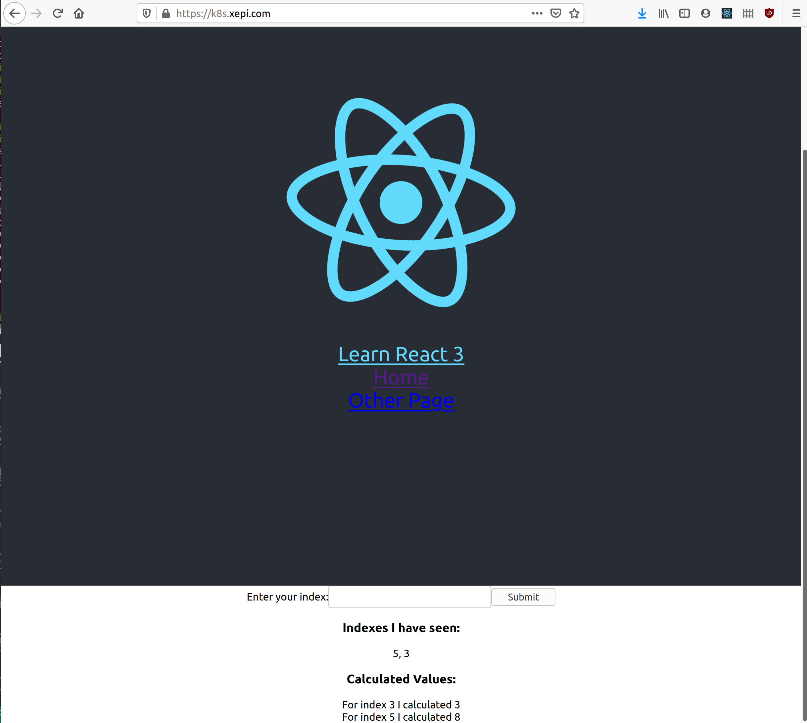
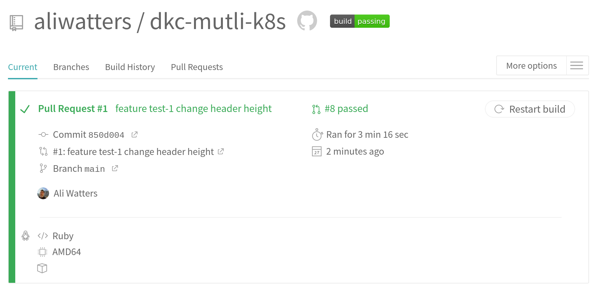
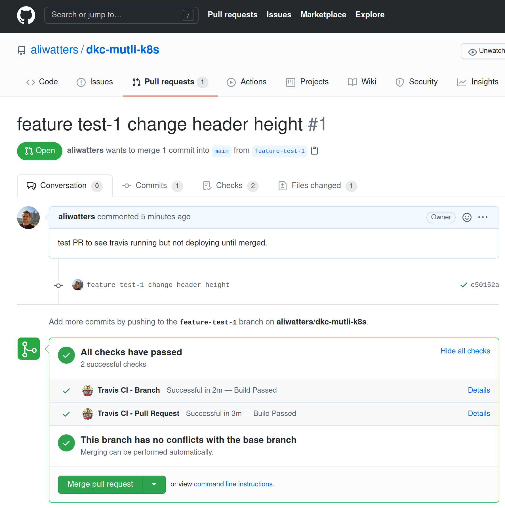
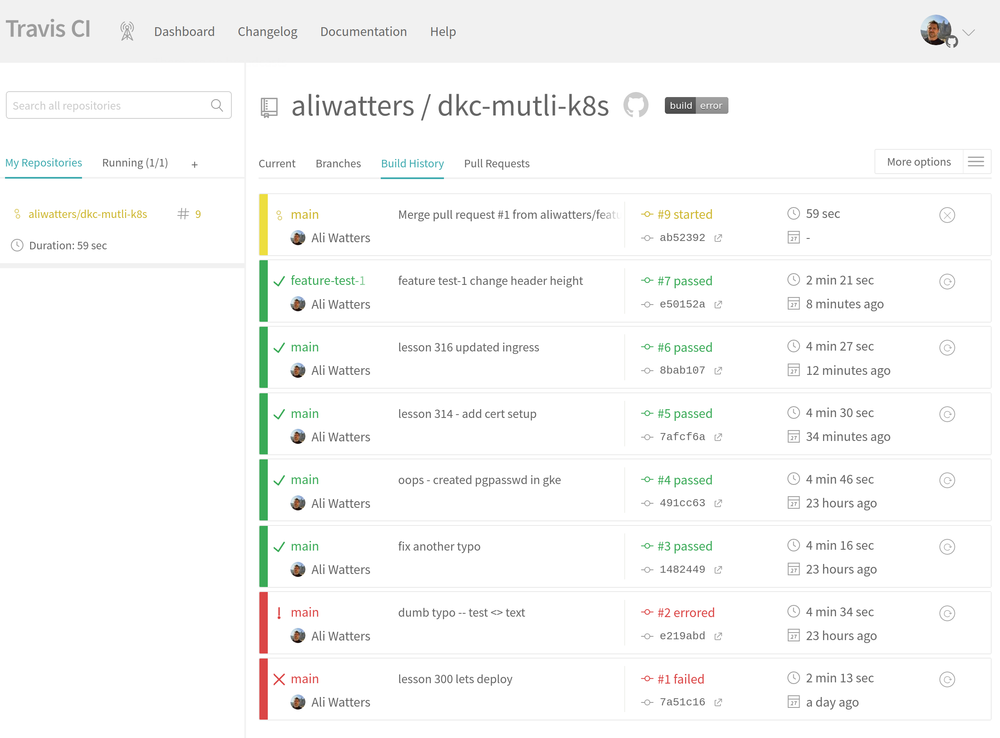
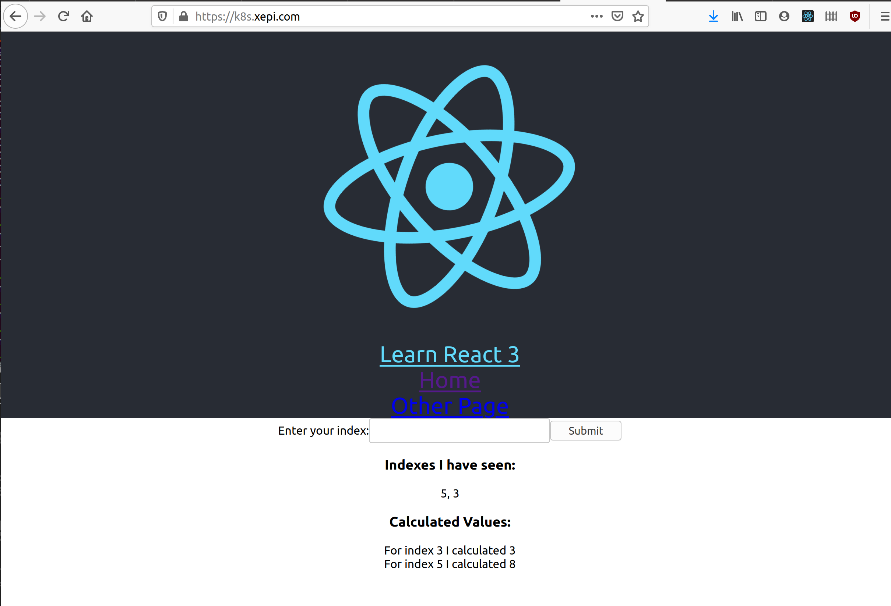
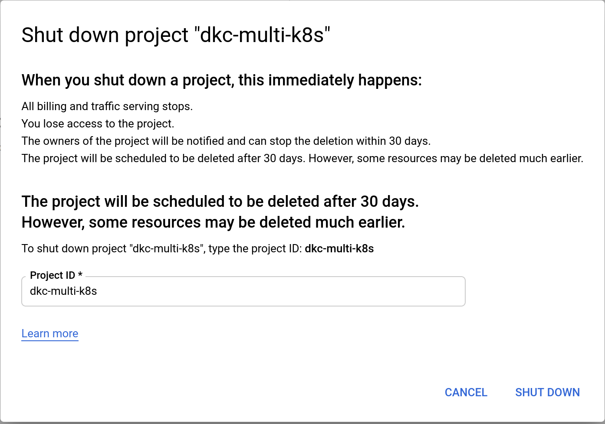

## Section 18 -- HTTPS in K8S

Uses letsencrypt, helm and google cloud.

Buy a domain, stuff. I've setup k8s.xepi.com as my domain, and set the A record as `35.193.110.15` the IP of the google cloud load balancer.

Errata on the next few lessons: from https://www.udemy.com/course/docker-and-kubernetes-the-complete-guide/learn/lecture/16924480

---

In the google cloud console:

1. Apply the yaml config file

`kubectl apply --validate=false -f https://raw.githubusercontent.com/jetstack/cert-manager/release-0.11/deploy/manifests/00-crds.yaml`

2. Create the namespace for cert-manager

`kubectl create namespace cert-manager`

3. Add the Jetstack Helm repository

`helm repo add jetstack https://charts.jetstack.io`

4. Update your local Helm chart repository cache

`helm repo update`

5.  Install the cert-manager Helm chart:

Helm v2:

```
    helm install \
      --name cert-manager \
      --namespquestions
```

```
ace cert-manager \
 --version v0.11.0 \
 jetstack/cert-manager
```

Helm v3:

```
    helm install \
      cert-manager \
      --namespace cert-manager \
      --version v0.11.0 \
      jetstack/cert-manager
```

`issuer.yaml` file

In the "Issuer Config File" lecture, the yaml file will need a few small changes per these docs:

https://docs.cert-manager.io/en/latest/tasks/issuers/setup-acme/index.html#creating-a-basic-acme-issuer

1. Make sure to update apiVersion as shown on line 1

2. Add the solvers property

```
   apiVersion: cert-manager.io/v1alpha2
   kind: ClusterIssuer
   metadata:
   name: letsencrypt-prod
   spec:
   acme:
   server: https://acme-v02.api.letsencrypt.org/directory
   email: "youremail@email.com"
   privateKeySecretRef:
   name: letsencrypt-prod
   solvers: - http01:
   ingress:
   class: nginx
```

`certificate.yaml` file

In the "Certificate Config File" lecture, only one minor change is required.

1. The only change needed in this file is to update the apiVersion on line 1:

`apiVersion: cert-manager.io/v1alpha2`

ingress-service.yaml file

In the "Ingress Config for HTTPS" lecture, we need to change one of the annotations.

```
certmanager.k8s.io/cluster-issuer: 'letsencrypt-prod'
```

change to:

```
cert-manager.io/cluster-issuer: "letsencrypt-prod"ext few lessons:
```

**My Results**

```
ali_watters@cloudshell:~$ kubectl config current-context
gke_dkc-multi-k8s_us-central1-c_dkc-multi-cluster
ali_watters@cloudshell:~$ kubectl apply --validate=false -f https://raw.githubusercontent.com/jetstack/cert-manager/release-0.11/deploy/manifests/00-crds.
yaml
customresourcedefinition.apiextensions.k8s.io/challenges.acme.cert-manager.io created
customresourcedefinition.apiextensions.k8s.io/orders.acme.cert-manager.io created
customresourcedefinition.apiextensions.k8s.io/certificaterequests.cert-manager.io created
customresourcedefinition.apiextensions.k8s.io/certificates.cert-manager.io created
customresourcedefinition.apiextensions.k8s.io/clusterissuers.cert-manager.io created
customresourcedefinition.apiextensions.k8s.io/issuers.cert-manager.io created
ali_watters@cloudshell:~$ kubectl create namespace cert-manager
namespace/cert-manager created
ali_watters@cloudshell:~$ helm repo add jetstack https://charts.jetstack.io
"jetstack" has been added to your repositories
ali_watters@cloudshell:~$ helm repo update
Hang tight while we grab the latest from your chart repositories...
...Successfully got an update from the "ingress-nginx" chart repository
...Successfully got an update from the "jetstack" chart repository
Update Complete. ⎈ Happy Helming!⎈
ali_watters@cloudshell:~$ helm install cert-manager --namespace cert-manager --version v0.11.0 jetstack/cert-manager
NAME: cert-manager
LAST DEPLOYED: Sat Jan 16 14:42:38 2021
NAMESPACE: cert-manager
STATUS: deployed
REVISION: 1
TEST SUITE: None
NOTES:
cert-manager has been deployed successfully!
In order to begin issuing certificates, you will need to set up a ClusterIssuer
or Issuer resource (for example, by creating a 'letsencrypt-staging' issuer).
More information on the different types of issuers and how to configure them
can be found in our documentation:
https://docs.cert-manager.io/en/latest/reference/issuers.html
For information on how to configure cert-manager to automatically provision
Certificates for Ingress resources, take a look at the `ingress-shim`
documentation:
https://docs.cert-manager.io/en/latest/reference/ingress-shim.html
```

Next steps -- create the `certificate.yaml` and `issuer.yaml` that `jetstack/cert-manager` uses to request certs from `letsencrypt`.

Commit, push, wait for Travis.

More information: https://cert-manager.io/

After dployment is complete:

```
ali_watters@cloudshell:~$ kubectl get all
NAME                                                      READY   STATUS    RESTARTS   AGE
pod/client-deployment-786c74d9bd-8fp5j                    1/1     Running   0          26s
pod/client-deployment-786c74d9bd-c7gwk                    1/1     Running   0          29s
pod/client-deployment-786c74d9bd-rg2jk                    1/1     Running   0          23s
pod/cm-acme-http-solver-fv8m9                             1/1     Running   0          28s
pod/my-release-ingress-nginx-controller-fd695f857-n6s4k   1/1     Running   0          24h
pod/postgres-deployment-f674d5947-l56kz                   1/1     Running   0          22h
pod/redis-deployment-778647c78-cmp7r                      1/1     Running   0          22h
pod/server-deployment-75b45784-82vq6                      1/1     Running   0          20s
pod/server-deployment-75b45784-j2z2s                      1/1     Running   0          25s
pod/server-deployment-75b45784-wtnzb                      1/1     Running   0          30s
pod/worker-deployment-789899b55f-lsrbn                    1/1     Running   0          29s

NAME                                                    TYPE           CLUSTER-IP     EXTERNAL-IP     PORT(S)                      AGE
service/client-cluster-ip-service                       ClusterIP      10.80.5.142    <none>          3000/TCP                     22h
service/cm-acme-http-solver-kjr99                       NodePort       10.80.15.225   <none>          8089:30626/TCP               28s
service/kubernetes                                      ClusterIP      10.80.0.1      <none>          443/TCP                      2d23h
service/my-release-ingress-nginx-controller             LoadBalancer   10.80.15.142   35.193.110.15   80:32718/TCP,443:32423/TCP   24h
service/my-release-ingress-nginx-controller-admission   ClusterIP      10.80.1.70     <none>          443/TCP                      24h
service/postgres-cluster-ip-service                     ClusterIP      10.80.9.59     <none>          5432/TCP                     22h
service/redis-cluster-ip-service                        ClusterIP      10.80.5.184    <none>          6379/TCP                     22h
service/server-cluster-ip-service                       ClusterIP      10.80.8.172    <none>          5000/TCP                     22h

NAME                                                  READY   UP-TO-DATE   AVAILABLE   AGE
deployment.apps/client-deployment                     3/3     3            3           22h
deployment.apps/my-release-ingress-nginx-controller   1/1     1            1           24h
deployment.apps/postgres-deployment                   1/1     1            1           22h
deployment.apps/redis-deployment                      1/1     1            1           22h
deployment.apps/server-deployment                     3/3     3            3           22h
deployment.apps/worker-deployment                     1/1     1            1           22h

NAME                                                            DESIRED   CURRENT   READY   AGE
replicaset.apps/client-deployment-5998946d77                    0         0         0       22h
replicaset.apps/client-deployment-5b9749f4f8                    0         0         0       22h
replicaset.apps/client-deployment-664fd568d9                    0         0         0       22h
replicaset.apps/client-deployment-77ffcf4c78                    0         0         0       22h
replicaset.apps/client-deployment-786c74d9bd                    3         3         3       29s
replicaset.apps/my-release-ingress-nginx-controller-fd695f857   1         1         1       24h
replicaset.apps/postgres-deployment-6fb8d99dc4                  0         0         0       22h
replicaset.apps/postgres-deployment-f674d5947                   1         1         1       22h
replicaset.apps/redis-deployment-778647c78                      1         1         1       22h
replicaset.apps/server-deployment-75b45784                      3         3         3       30s
replicaset.apps/server-deployment-75db5659f7                    0         0         0       22h
replicaset.apps/server-deployment-865d94bc76                    0         0         0       22h
replicaset.apps/server-deployment-958d4c486                     0         0         0       22h
replicaset.apps/server-deployment-97b7db58f                     0         0         0       22h
replicaset.apps/server-deployment-97d7cd74b                     0         0         0       22h
replicaset.apps/worker-deployment-67ddbf7966                    0         0         0       22h
replicaset.apps/worker-deployment-789899b55f                    1         1         1       29s
replicaset.apps/worker-deployment-848bd5bfdf                    0         0         0       22h
replicaset.apps/worker-deployment-995df94f                      0         0         0       22h
```

```
ali_watters@cloudshell:~$ kubectl get certificates
NAME               READY   SECRET         AGE
k8s-xepi-com-tls   True    k8s-xepi-com   3m1s
```

```
ali_watters@cloudshell:~$ kubectl describe certificates
Name:         k8s-xepi-com-tls
Namespace:    default
Labels:       <none>
Annotations:  <none>
API Version:  cert-manager.io/v1alpha2
Kind:         Certificate
Metadata:
  Creation Timestamp:  2021-01-16T15:17:50Z
  Generation:          1
  Managed Fields:
    API Version:  cert-manager.io/v1alpha2
    Fields Type:  FieldsV1
    fieldsV1:
      f:metadata:
        f:annotations:
          .:
          f:kubectl.kubernetes.io/last-applied-configuration:
      f:spec:
        .:
        f:acme:
          .:
          f:config:
        f:commonName:
        f:dnsNames:
        f:issuerRef:
          .:
          f:kind:
          f:name:
        f:secretName:
    Manager:      kubectl
    Operation:    Update
    Time:         2021-01-16T15:17:50Z
    API Version:  cert-manager.io/v1alpha2
    Fields Type:  FieldsV1
    fieldsV1:
      f:status:
        .:
        f:conditions:
        f:notAfter:
    Manager:         jetstack-cert-manager
    Operation:       Update
    Time:            2021-01-16T15:18:32Z
  Resource Version:  1562156
  Self Link:         /apis/cert-manager.io/v1alpha2/namespaces/default/certificates/k8s-xepi-com-tls
  UID:               e291ae2f-26c9-42a6-9fc3-0f6dc62d5115
Spec:
  Common Name:  k8s.xepi.com
  Dns Names:
    k8s.xepi.com
  Issuer Ref:
    Kind:       ClusterIssuer
    Name:       letsencrypt-prod
  Secret Name:  k8s-xepi-com
Status:
  Conditions:
    Last Transition Time:  2021-01-16T15:18:32Z
    Message:               Certificate is up to date and has not expired
    Reason:                Ready
    Status:                True
    Type:                  Ready
  Not After:               2021-04-16T14:18:31Z
Events:
  Type    Reason        Age    From          Message
  ----    ------        ----   ----          -------
  Normal  GeneratedKey  3m36s  cert-manager  Generated a new private key
  Normal  Requested     3m36s  cert-manager  Created new CertificateRequest resource "k8s-xepi-com-tls-116522017"
  Normal  Issued        2m55s  cert-manager  Certificate issued successfully
```

```
ali_watters@cloudshell:~$ kubectl get secrets
NAME                                   TYPE                                  DATA   AGE
default-token-rw6h2                    kubernetes.io/service-account-token   3      2d23h
k8s-xepi-com                           kubernetes.io/tls                     3      4m52s
my-release-ingress-nginx-admission     Opaque                                3      24h
my-release-ingress-nginx-token-kmrdp   kubernetes.io/service-account-token   3      24h
pgpasswd                               Opaque                                1      24h
sh.helm.release.v1.my-release.v1       helm.sh/release.v1                    1      24h
```

At this point we have a certificate! Last thing to do is link it up with the `nginx-ingress.yaml`

Commit, merge, deploy, wait. And -- IT WORKED, first time which is always nice. Wonder if this includes autorenew and all that good stuff. Things to dig in to when applying to travelblog.org



Ran through quick PR flow for just seeing it: https://github.com/aliwatters/dkc-mutli-k8s/tree/feature-test-1 -- should reduce the height of that obnoxious react logo.



---



---



---



Last up: https://www.udemy.com/course/docker-and-kubernetes-the-complete-guide/learn/lecture/11684242 -- clean up of google cloud.

I went through this a little slower than usual, hectic time at work, so went through $5 costs.



Done.

Next up skaffold: [Section 19 -- Skaffold](section-19.md)
