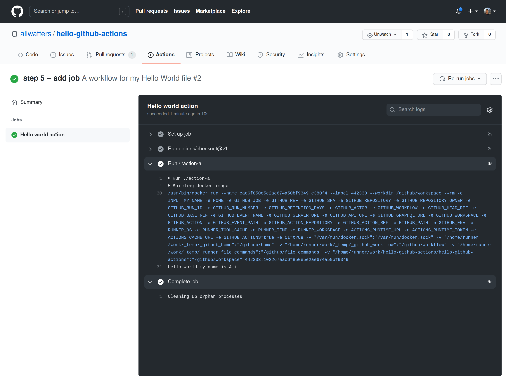
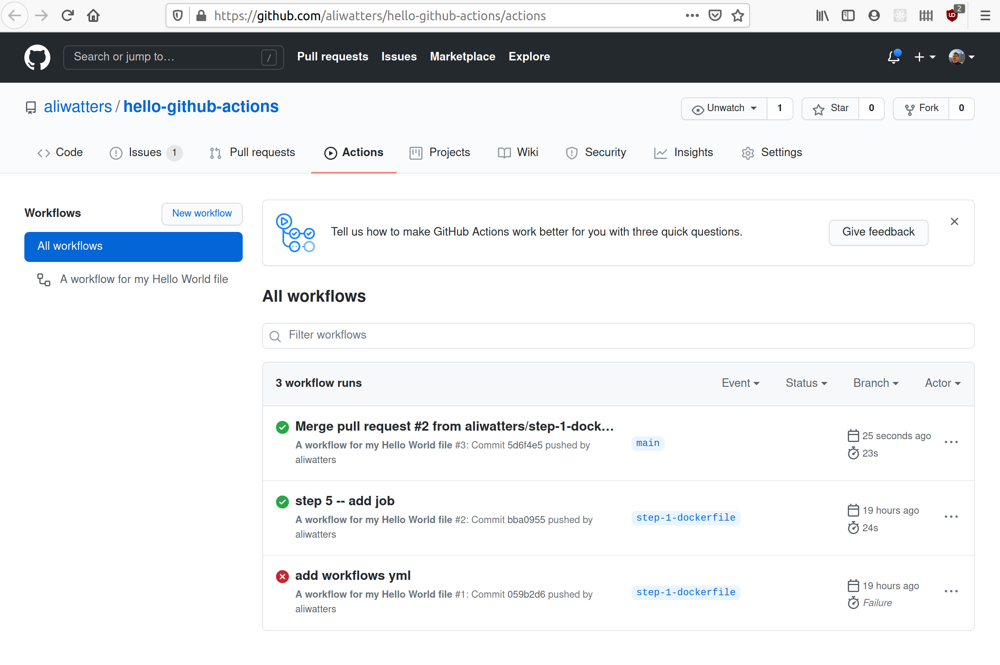
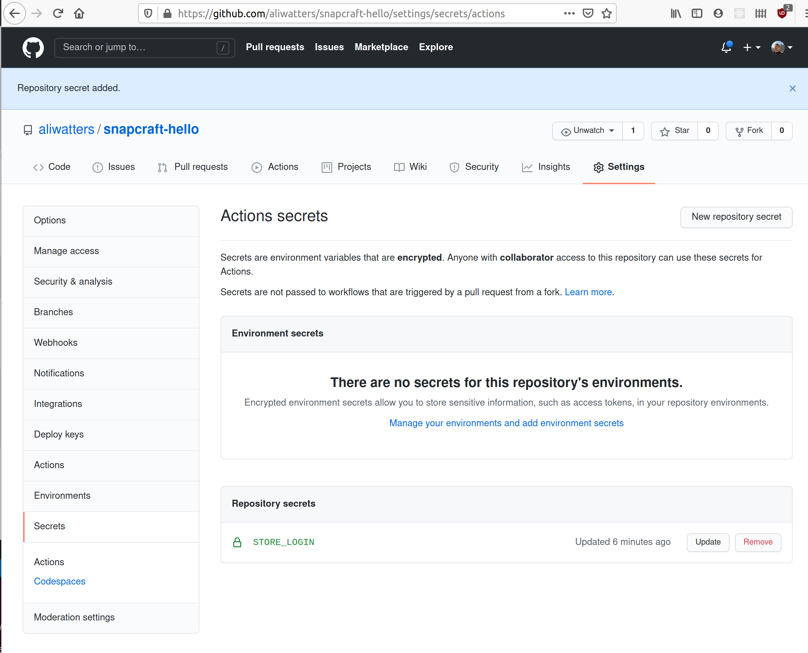

# Github Actions

**1/29/21**

Github recently (for me anyways) introduced actions that can do things like CI steps etc.

I need to understand the capabilities and how to use this; https://docs.github.com/en/actions

Goals:

1. run through the hello-world
2. see if I can make a skaffold branch where this can happen
3. submit a PR -- note what secrets are needed to make happen

I'm noting the specific skaffold work here: [Skaffold Development](../skaffold/README.md)

## 1. Find a tutorial for github actions and complete

https://lab.github.com/githubtraining/github-actions:-hello-world -- looks appropriate

Clicking "start training course" made a repo and created an issue; kind of neat -- https://github.com/aliwatters/hello-github-actions/issues/1

Seven steps to complete this course.

Done.

### Summary

Set up an action, decide in what env you want the action to execute, this can be a docker image.

Organize by folders, with the actions in them. Control overall with a `.github/

```
ali@stinky:~/git/hello-github-actions (main)$ pwd
/home/ali/git/hello-github-actions

ali@stinky:~/git/hello-github-actions (main)$ cat action-a/entrypoint.sh
#!/bin/sh -l

sh -c "echo Hello world my name is $INPUT_MY_NAME"

ali@stinky:~/git/hello-github-actions (main)$ cat action-a/Dockerfile
FROM debian:9.5-slim

ADD entrypoint.sh /entrypoint.sh
RUN chmod +x /entrypoint.sh
ENTRYPOINT ["/entrypoint.sh"]

ali@stinky:~/git/hello-github-actions (main)$ cat action-a/
action.yml     Dockerfile     entrypoint.sh

ali@stinky:~/git/hello-github-actions (main)$ cat action-a/action.yml
name: "Hello Actions"
description: "Greet someone"
author: "octocat@github.com"

inputs:
  MY_NAME:
    description: "Who to greet"
    required: true
    default: "World"

runs:
  using: "docker"
  image: "Dockerfile"

branding:
  icon: "mic"
```

And in the `.github` folder.

```
ali@stinky:~/git/hello-github-actions (main)$ cat .github/workflows/main.yml
name: A workflow for my Hello World file
on: push
jobs:
  build:
    name: Hello world action
    runs-on: ubuntu-latest
    steps:
      - uses: actions/checkout@v1
      - uses: ./action-a
        with:
          MY_NAME: "Ali"

```

That's all folks. Looks very straightforward at least to get started.

### Extra questions

**1/31**
**How much does it cost?**

https://docs.github.com/en/github/setting-up-and-managing-billing-and-payments-on-github/about-billing-for-github-actions -- free tier has 2000 minutes and 500 MB storage.

Note there is a MacOS environment (at 10x cost!) -- but very interesting.

**Where do I see my usage?**

https://github.com/settings/billing -- note that the "hello world" seems to have cost nothing.

**Is it possible to publish docker images?**

It should be yes, checking. https://docs.github.com/en/actions/guides/publishing-docker-images

**What about the secrets?**

https://docs.github.com/en/actions/reference/encrypted-secrets

```
steps:
  - name: Hello world action
    with: # Set the secret as an input
      super_secret: ${{ secrets.SuperSecret }}
    env: # Or as an environment variable
      super_secret: ${{ secrets.SuperSecret }}
```

> You can store up to 1,000 secrets per organization, 100 secrets per repository, and 100 secrets per environment. A workflow may use up to 100 organization secrets and 100 repository secrets. Additionally, a job referencing an environment may use up to 100 environment secrets.
>
> Secrets are limited to 64 KB in size. To use secrets that are larger than 64 KB, you can store encrypted secrets in your repository and save the decryption passphrase as a secret on GitHub. For example, you can use gpg to encrypt your credentials locally before checking the file in to your repository on GitHub. For more information, see the "gpg manpage."

**What events can they be triggered by?**

https://docs.github.com/en/actions/reference/events-that-trigger-workflows

Many! And everything in the tutorial was triggered through actions.

**Limiting to only main branches?**

```
on:
  # Trigger the workflow on push or pull request,
  # but only for the main branch
  push:
    branches:
      - main
  pull_request:
    branches:
      - main
```

## Setting up a snapcraft build and push in Github Actions

https://github.com/abskmj/notes/blob/master/content/posts/github/actions/setup-snapcraft.md

1. Create and add a `SNAPCRAFT_TOKEN` as a varialbe in github (probably repo level)

2. Add a workflow file similar to this

```
name: Build
on:
  push:
    branches: [ master ]
jobs:
  build:
    runs-on: ubuntu-latest
    steps:
    - uses: actions/checkout@v2
        cd ..
    - name: Setup Snapcraft
      run: |
        sudo snap install snapcraft --classic
        echo "$SNAP_TOKEN" | snapcraft login --with -
        snapcraft
        snapcraft upload --release=stable *.snap
      env:
        SNAP_TOKEN: ${{secrets.SNAP_TOKEN}}
        SNAPCRAFT_BUILD_ENVIRONMENT: host
```

Ok... that looks easy -- lets try a hello-world.

```
ali@stinky:~/git$ ls ~/mysnaps/hello/
aliwatters-hello_2.10_amd64.snap  snap

ali@stinky:~/git$ more ~/mysnaps/hello/snap/snapcraft.yaml
name: aliwatters-hello
base: core18
version: '2.10'
summary: GNU Hello, the "hello world" snap
description: |
  GNU hello prints a friendly greeting.

grade: stable
confinement: strict

apps:
  hello:
    command: bin/hello
  bash:
    command: bash

parts:
  gnu-hello:
    source: http://ftp.gnu.org/gnu/hello/hello-2.10.tar.gz
    plugin: autotools
  gnu-bash:
    source: http://ftp.gnu.org/gnu/bash/bash-4.3.tar.gz
    plugin: autotools
```





### 1. Make a git repo for these files...

might make sense to symlink from/to `~/git/mysnaps` -- and git ignore the binaries.

Ok -- each snap would need to be a separate reop. Maybe prefix the repo with `snapcraft-<name>`

Trying this.



Secret was created with:

```
$ snapcraft export-login --snaps=aliwatters-hello    --acls package_access,package_push,package_update,package_release       exported.txt
Enter your Ubuntu One e-mail address and password.
If you do not have an Ubuntu One account, you can create one at https://snapcraft.io/account
Email: ali.watters@example.com
Password:

We strongly recommend enabling multi-factor authentication: https://help.ubuntu.com/community/SSO/FAQs/2FA

Login successfully exported to 'exported.txt'. This can now be used with

    snapcraft login --with exported.txt

to log in to this account with no password and have these
capabilities:

snaps:       ['aliwatters-hello']
channels:    No restriction
permissions: ['package_access', 'package_push', 'package_update', 'package_release']
expires:     2022-01-31T16:07:15.586639

This exported login is not encrypted. Do not commit it to version control!
```

Added:

```
$ cat .github/workflows/publish.yml
name: "build-publish"
on: # rebuild any PRs and main branch changes
  pull_request:
  push:
    branches:
      - main
      - 'releases/*'

jobs:
  build:
    runs-on: ubuntu-latest
    steps:
    - uses: actions/checkout@v2
    - uses: snapcore/action-build@v1
      id: build
    - uses: snapcore/action-publish@v1
      with:
        store_login: ${{ secrets.STORE_LOGIN }}
        snap: ${{ steps.build.outputs.snap }}
        release: edge
```

## Result

In the build steps, https://github.com/aliwatters/snapcraft-hello/runs/1801698139?check_suite_focus=true

```
Run snapcore/action-publish@v1
Publishing snap "aliwatters-hello_2.10_amd64.snap"...
/snap/bin/snapcraft login --with /tmp/login-data-73ZbEk/login.txt
Invalid login config: Source contains parsing errors: '<string>'
```

Enough for now ... next step -- maybe an issue on https://github.com/snapcore/action-publish/issues -- asking for help, but not very active, worth a try though.

**1/2**

Made it work! -- unblocked!

Note: the broken actions were due to `\n` in the copy and paste of the `exported.txt` values in the secret -- avoid that and all works!

```
[login.ubuntu.com]
macaroon = MDAyOWxvY2F0aW9..<long snip>..fXbRYgo
unbound_discharge = MDAxZWxv..<long snip>..Y2DcHJOOEs email = ali.watters@gmail.com
```

https://github.com/aliwatters/snapcraft-hello/actions/runs/525577853
