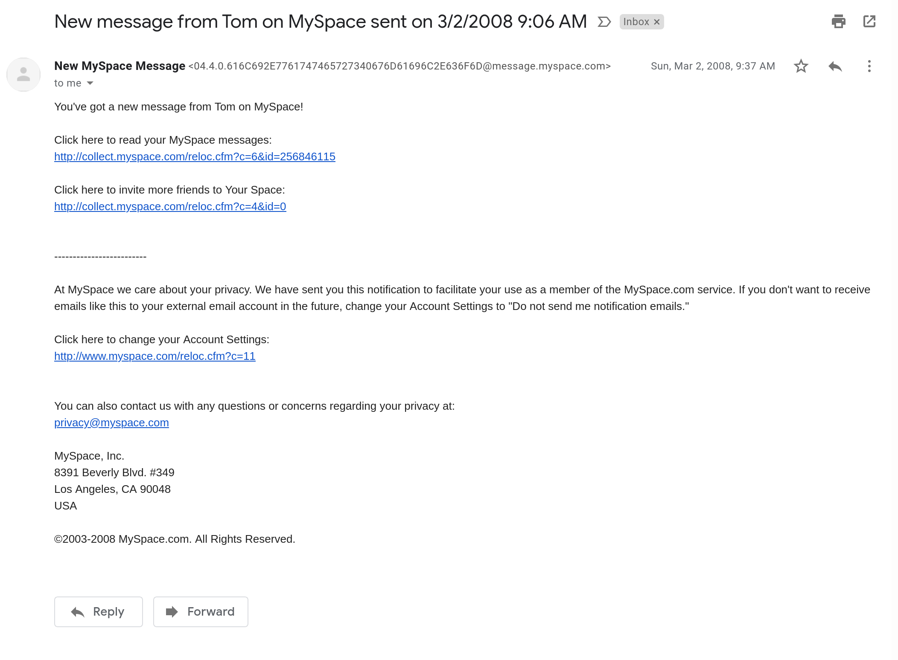

# How to Clean Up Gmail

## or hero to zero

I had about 30,000+ unread emails in my gmail account. I went through last year and used a combo of searches to identify and remove/mark as read many of them, and got it back to a reasonable level.

Unfortunately, it's back at 3,000 a year later. Can I get to inbox zero?

This time I'm going to write down the steps and make it easier.

1. Start with the oldest stuff;

`older_than:12y is:unread` -- yep, this comes back with hundreds of matches

2. In that pile of stuff, look for emails from things that no longer have relevance

Examples:

`from: hostelworld.com` -- been a while since I travelled, even longer since I stayed in a hostel. Quick scan and 41 emails deleted.
`from: egg.com` -- now defunct online bank
`from: lastminute.com ` -- was a UK hotel discount place
`from: elance.com ` -- freelancer website

3. Ok slowly making progress, so lets see if we can focus on things that save quota

`has:attachment older_than:10y is:unread` -- really old things with attachment -- here noted that I send myself a lot of stuff, from other accounts.

`from: noreply & from: google.com ` -- alerts from various google stuff. I missed out on a class action against google plus.

I never wrote back, sorry Tom.

`from: myspace.com ` -- seriously, delete.

After about 30mins, or longer :( -- down to 1,500 unread emails.

`older_than:10y is:unread ` -- next step.
