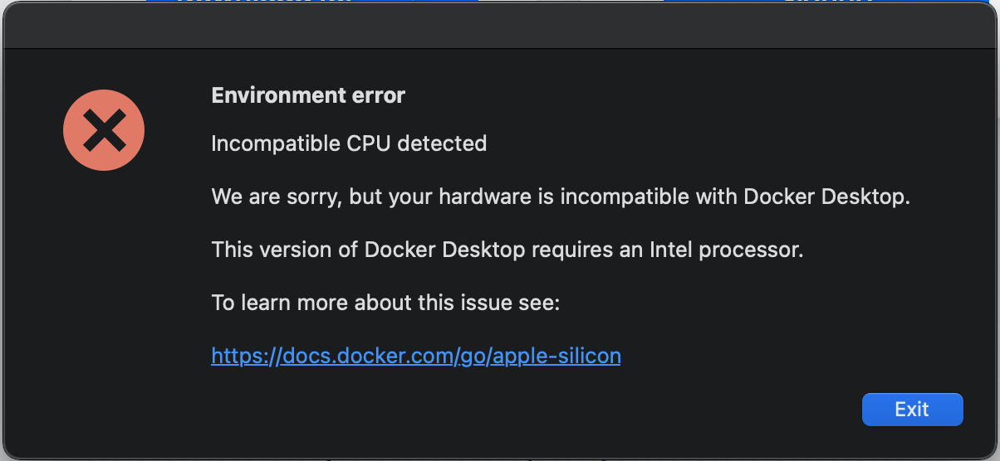

# Getting setup on a Mac mini M1 (16GB)

So far, login to my apple account and do the usual.

- download firefox and login to the firefox account
- install iterm2 (now defaulting to zsh)
    - turn of the bell!
- clone `.ssh` from an existing development machine (scp)
- rename machine something nice (alis-mac-mini yuck, titan, yum)
- add `titan` to default `.ssh/config`
- run `xcode-select` to get git and xcode running
- install `bettersnaptool` from store
- visit https://code.visualstudio.com/ and install vscode
    - run `cmd + shift + P` and type `shell command` - to add `code` to the command line
    - ensure `vim` extension is running
    - note: here should check the list of extensions running on work laptop
        - vim
        - eslint
        - docker
        - apollo graphql
        - git blame
        - postgresSQL
        - prettier
        - tslint
        - yaml
    - and the following I'll only install as needed
        - vscode ruby
        - smart column formatter
        - ruby 
        - ruby-rubocop
        - live share
- docker
    - see https://www.docker.com/get-started
    - oh no! -- the first thing that failed due to "apple silicon" -- it's on the roadmap
        - https://github.com/docker/roadmap/issues/142

        

    - wonder if there's an alpha release!
    - https://finestructure.co/blog/2020/11/27/running-docker-on-apple-silicon-m1 -- some
    - https://finestructure.co/blog/2020/11/27/running-docker-on-apple-silicon-m1 -- some hacky ways to get things running. But note; lots of packages will have issues. Basically get a VM run in there.
    - 

### Notes on git: run

```
ali@titan % git version
git version 2.24.3 (Apple Git-128)
ali@titan % git config --global user.name "Ali Watters"
ali@titan % git config --global user.email "ali.watters@<someprovider>.com"
ali@titan % git config --global init.defaultBranch main

ali@titan ~ % git config --list
credential.helper=osxkeychain
user.name=Ali Watters
user.email=ali.watters@<someprovider>.com
init.defaultbranch=main
```

## Installing some extra stuff that is kind of interesting

### Drobo -- an aside

This has been a palava, I purchased a drobo 5n in ~2013 added 4x 4tb drives and a 128gb mSata ssd cache. It's been running in the basement until a few weeks back when after a series of power outages, everything flashed red. I tried systematically removing drives to find out which had failed and nothing worked.

Yesterday, I tried the one last thing I could think of, remove the ssd (kind of forgot it was there). That worked! A single drive had failed, removed it and now it's in green/yellow flashing recovery mode and rebuilding data!

Logged into drobo.com and regained access and found two very interesting files. `dogecoin.dat` and `litecoin.dat` -- oh no, now I have to hope I can remember passwords from these experiments back in 2012!

I won't install either wallet on this machine, the ~20gb for blockchain on both is too large for a 256gb SSD, time to dust off another old windows box.

1/19 Just installed new hard drive and new mSata SSD (256gb) and every thing on the drobo is running great again! 14.4 TB capacity.

### Steam

I have no idea when I'll play games, but I installed my steam account! Doesn't look like any of the games I have will run on mac though!

### 
